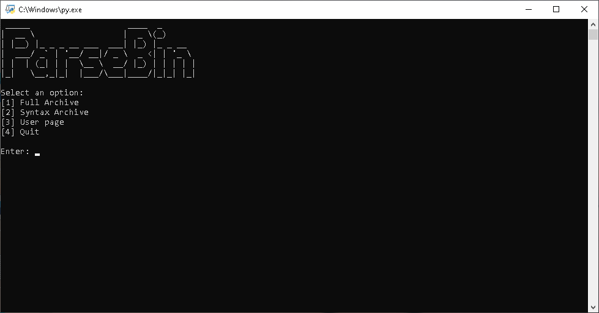

# parsebin
Pastebin Parser

A handy tool for parsing and massdownloading pastes from Pastebin.

You can download pastes from:
Public archive (pastebin.com/archive)
Syntax Archive (e.g. pastebin.com/archive/csharp)
User page (e.g. pastebin.com/juhis96)

